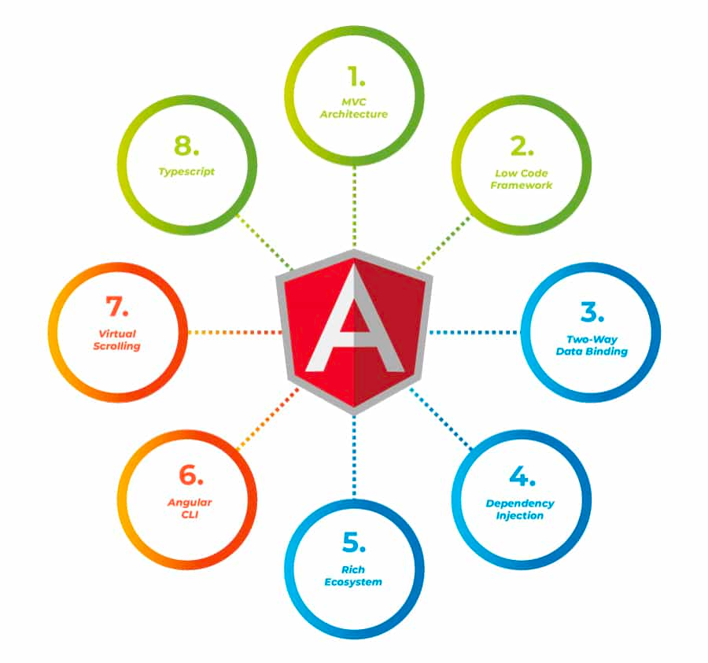

# What is Angular?

Angular is a popular open-source front-end web application framework
developed and maintained by Google. It is used for building dynamic and
robust [single-page applications (SPAs)](1.2.%20What%20is%20an%20SPA.md)
and cross-platform mobile applications. Angular follows the
Model-View-Controller (MVC) architectural pattern, where the application
logic and data are separated from the presentation layer.

Angular simplifies the development of complex web applications by
**providing a structured framework**, powerful features, and a wide
ecosystem of libraries and tools. It has gained popularity among
developers due to its scalability, performance, and extensive community
support.

## Angular Key Features

Key features of Angular include:

- TypeScript: Angular is built with TypeScript, a statically-typed
  superset of JavaScript. TypeScript adds static typing, classes,
  interfaces, and other advanced features to JavaScript, making it more
  scalable and maintainable.
- Component-based Architecture: Angular applications are structured as a
  collection of reusable components. Each component consists of a
  template that defines the view, a class that encapsulates the
  component's behavior and data, and styles for customizing the
  appearance.
- Data Binding: Angular provides powerful data binding capabilities,
  allowing easy synchronization of data between the application's
  components and the view. It supports both one-way and two-way data
  binding, making it convenient to handle user input and reflect changes
  in real-time.
- Dependency Injection: Angular utilizes a built-in dependency injection
  system to manage the dependencies of components and services. This
  approach promotes modular design, code reusability, and testability.
- Routing and Navigation: Angular offers a robust routing mechanism for
  creating multi-page applications. It enables navigation between
  different views and allows for the configuration of route parameters,
  guards, and lazy loading.
- Forms and Validation: Angular provides extensive support for building
  complex forms, including both template-driven and reactive forms. It
  offers a rich set of form controls, validators, and error handling
  mechanisms for validating and processing user input.
- Reactive Programming: Angular leverages the power of reactive
  programming with the RxJS library. It allows developers to handle
  asynchronous operations, such as HTTP requests, through the use of
  Observables and operators.
- Testing: Angular comes with comprehensive testing tools and utilities.
  It encourages writing unit tests, integration tests, and end-to-end
  tests to ensure the quality and reliability of the application.

  

