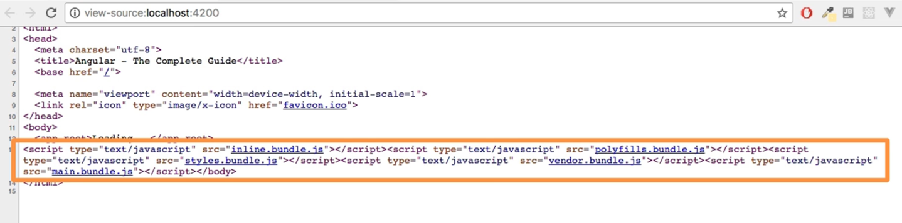

# Angular Bootstrap Process

The Angular bootstrap process refers to the initialization and startup
sequence of an Angular application. It involves several steps that occur
when the application is loaded and launched in a web browser. Here's a
description of the Angular bootstrap process:

1. Index.html: The bootstrap process begins with the `index.html` file,
   which serves as the entry point for the Angular application. Inside
   this file, there is  a `<script>` tag that loads the Angular
   runtime and other necessary dependencies.

2. Main.ts - Angular Runtime: The Angular runtime is loaded by the web browser
   based on the `<script>` tag in the `index.html` file. The runtime
   includes the Angular framework and the application code bundled by a
   build tool like Angular CLI.

3. AppModule: The main Angular module, usually named `AppModule`, is the
   starting point of the application. It is defined in a TypeScript
   file, typically named `app.module.ts`. This module acts as the root
   module and is responsible for bootstrapping the entire application.

4. NgModule Decorator: The `AppModule` class is decorated with the
   `@NgModule` decorator, which provides metadata about the module, such
   as the list of components, services, and other dependencies used by
   the application.

5. Bootstrap component: The `@NgModule` decorator specifies the root
   component of the application using the `bootstrap` property. The root
   component is typically named `AppComponent` and represents the
   top-level component in the application's component hierarchy.

6. Component Rendering: Once the root component is determined, Angular
   creates an instance of the root component and renders its template in
   the browser. The template may contain HTML markup along with
   Angular-specific directives and bindings.

7. Dependency Injection: Angular uses dependency injection to
   instantiate and inject services, components, and other dependencies
   into each other. During the bootstrap process, Angular creates
   instances of the services specified in the module's `providers` array
   and makes them available for injection throughout the application.
