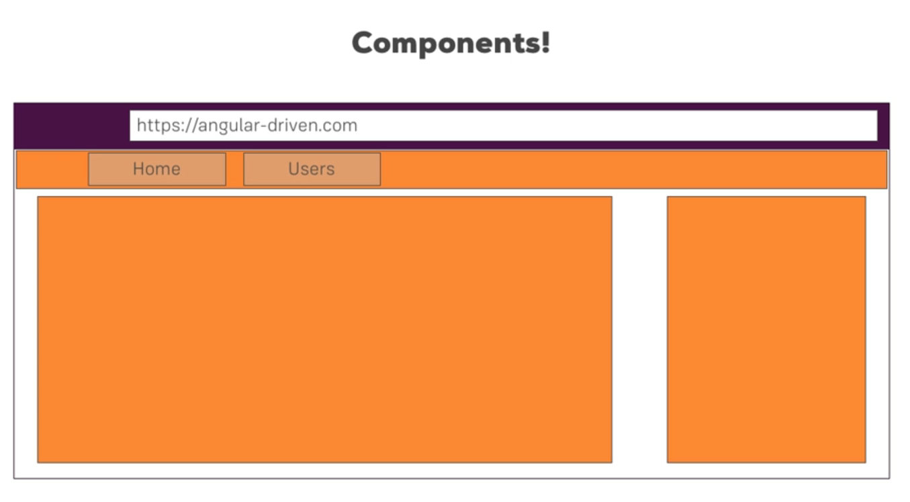

# What is a component?

In an Angular application, a component **is a fundamental building block
that encapsulates a specific part of the user interface (UI) and its
associated behavior**. Components are the key elements for creating
reusable and modular UI elements in Angular applications. They are
responsible for rendering the UI, handling user interactions, and
managing the data related to that specific part of the application.

A component in Angular consists of three main parts:
1. Template: The template defines the structure and layout of the
   component's UI. It is usually written in HTML with additional
   Angular-specific syntax and directives. The template can include
   bindings, conditionals, loops, and other HTML elements necessary for
   rendering the UI.

2. Class: The class represents the TypeScript code that accompanies the
   template. It contains the component's properties, methods, and logic.
   The class is typically decorated with the `@Component` decorator,
   which provides metadata about the component, such as its selector,
   template, styles, and more.

3. Metadata: The metadata is defined through the `@Component` decorator.
   It provides configuration options and information about the
   component, such as its selector (the custom HTML tag used to place
   the component in other templates), styles (CSS styles specific to the
   component), input and output properties, and more.

Components can be hierarchical, meaning they can contain other
components within them. This hierarchy of components forms the component
tree, where parent components can pass data to their child components
using input properties and receive information back through output
properties or events.

Components in Angular follow the principles of reusability and
modularity, allowing developers to create self-contained, independent
units of functionality that can be easily composed and reused throughout
the application. They promote separation of concerns and enable a clear
separation between UI and business logic.

Overall, components play a crucial role in the Angular application
architecture, enabling developers to build complex and dynamic user
interfaces by encapsulating UI elements, behavior, and data into
reusable and manageable units.
