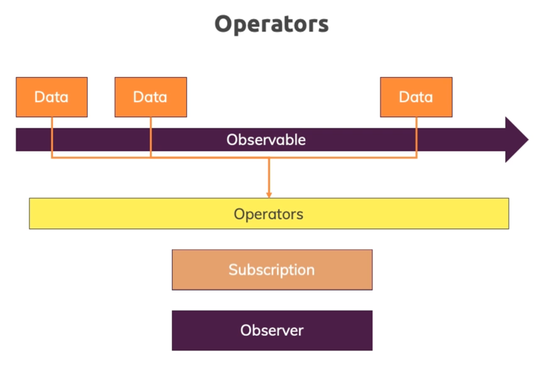

RxJS (Reactive Extensions for JavaScript) is a library for reactive programming using Observables. It provides a
collection of powerful utilities for composing asynchronous and event-based programs. RxJS is often used in Angular
applications but can be used in any JavaScript context.

Here are some of the fundamental concepts and terms:

### Observable

An Observable is a representation of any set of values over any amount of time. Observables are lazy, meaning that
nothing happens until a "subscription" is made. It's similar to a function that doesn't execute until you call it.

### Observer

An Observer is a consumer of values delivered by an Observable. Observers are simply a set of callbacks, one for each
type of notification delivered by the Observable: `next`, `error`, and `complete`.

### Subscription

A Subscription is essentially a way to keep track of Observables. A Subscription has one important method, `unsubscribe`
, that takes no argument and disposes of the resource held by the subscription.

### Operators

Operators are pure functions built to be used with Observables to enable sophisticated manipulation of collections.
Popular operators include `map`, `filter`, `mergeMap`, `switchMap`, and `catchError`.

### Subject

A Subject is like an Observable but can multicast to many Observers. Unlike Observables, which are only unicast (each
subscribed Observer owns an independent execution of the Observable), Subjects are multicast.

### Scheduler

Schedulers control the concurrency in RxJS, allowing you to control when computation happens on e.g., `setTimeout`
, `requestAnimationFrame`, or others.

---

### Why Use RxJS?

1. **Asynchronous Operations**: Helps to deal with asynchronous operations, like making HTTP requests, handling user
   interactions, etc.

2. **Stream-based**: It treats everything as a stream. This helps in implementing complex UI interactions, real-time
   updates, and so on.

3. **Functional Style**: You can use functional programming concepts to create and process complex data transformation
   pipelines.

4. **Composability**: Operators can be piped together, making it easy to compose larger, more complex operations out of
   simpler ones.

5. **Lazy Computation**: Observables are lazy computations, meaning that you can define a complex operation linking
   multiple events, and none of the registered events happen until you subscribe.

6. **Error Handling**: It has robust error-handling mechanisms.

7. **Resource Management**: Automatic resource management features, like unsubscribing from an observable stream, are
   built-in and easy to use.

RxJS is a critical part of the Angular ecosystem, but it comes with a learning curve. Understanding how to use
Observables and operators effectively can greatly simplify complex async tasks and make your applications more robust
and scalable.
